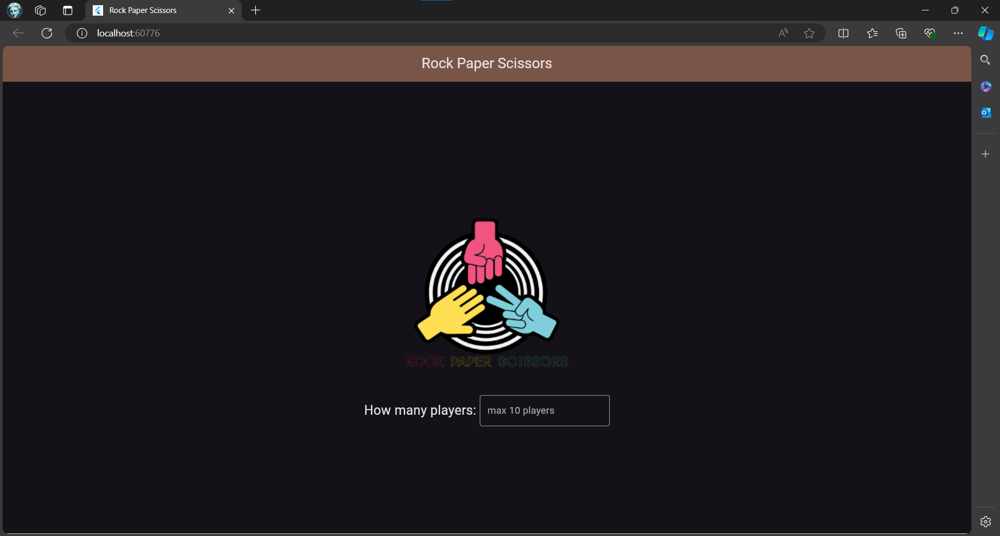

# Rock-Paper-Scissors
Flutter implementation of popular rock-paper-scissors game for web

## Features
- Up to 10 players
- Easy GUI to enable playing

## UI Samples

> Homepage

> Standby state before the game "runs"

> A draw happens if all 3 possible hands are available

> A win/loss is determined when all players consist of any of two hands

> A single winnner is realized with the orange tag

## Comments
- Not a very well commented codebase as this was my first "real" project
- When a final winner is gotten the run still occurs and switches to a new hand before identifying as a winner; need to work on that bug.
- Would be interesting to implement ability for players on two different devices to play against each other.